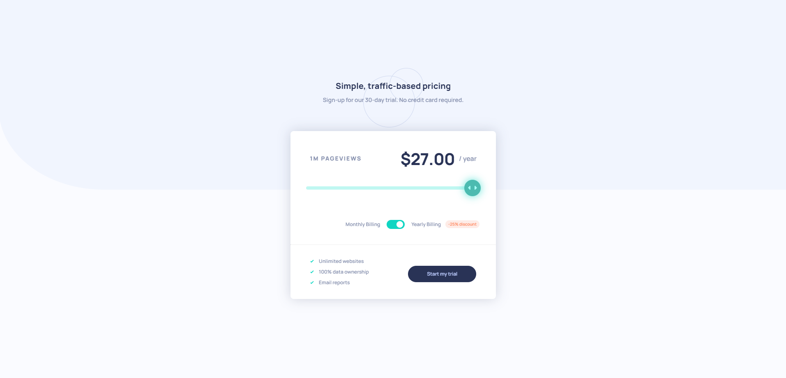

# Frontend Mentor - Interactive pricing component solution

This is a solution to the [Interactive pricing component challenge on Frontend Mentor](https://www.frontendmentor.io/challenges/interactive-pricing-component-t0m8PIyY8). Frontend Mentor challenges help you improve your coding skills by building realistic projects. 

## Table of contents

- [Overview](#overview)
  - [The challenge](#the-challenge)
  - [Screenshot](#screenshot)
  - [Links](#links)
- [My process](#my-process)
  - [Built with](#built-with)
  - [What I learned](#what-i-learned)
  - [Useful resources](#useful-resources)
- [Author](#author)

## Overview

### The challenge

Users should be able to:

- View the optimal layout for the app depending on their device's screen size
- See hover states for all interactive elements on the page
- Use the slider and toggle to see prices for different page view numbers

### Screenshot

- Main: 

### Links

- Solution URL: [Add solution URL here](https://your-solution-url.com)
- Live Site URL: [Add live site URL here](https://your-live-site-url.com)

## My process

### Built with

- Semantic HTML5 markup
- CSS custom properties
- Flexbox
- CSS Grid
- Mobile-first workflow
- [Styled Components](https://styled-components.com/) - For styles

### What I learned

- Object.assign: Instead of reseting the values of the priceRange by e.g. 'priceRange["10K"] = 8' method, Object.assign method is cleaner to write.

```
Object.assign(priceRange, {
    "10K": 8,
    "50K": 12,
    "100K": 16,
    "500K": 24,
    "1M": 36,
});
```

- Object.entries: By splitting the list of prices into key-value pairs, I am able to iterate through the list and update the viewsNum and respective prices dynamically with just a few lines of code.

```
if (!document.getElementById("toggle").checked) {
        viewsNum.textContent = `${key} PAGEVIEWS`;
        price.textContent = `$${value}.00`;
} else {
    perMonth.textContent = " / year";
    price.textContent = `$${value}.00`;
}
```

### Useful resources

- [How to Iterate Over Object Keys With JavaScript](https://code.tutsplus.com/tutorials/how-to-iterate-over-object-keys-with-javascript--cms-41132) - I learned about iterating through creating key-value pairs with objects which helped me to write a cleaner and shorter code for the sliderBar output/update.

## Author

- Frontend Mentor - [@Jo-cloud85](https://www.frontendmentor.io/profile/Jo-cloud85)
